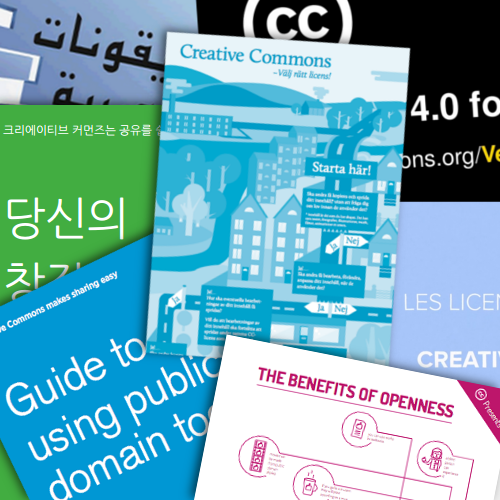

INSERT HEADER FOR PAGE

      

      

        

          <h2 class="featurette-heading">CC Resource Archive Submit a resource</h2>
          
Want to see more resources that help explain CC? Come view the archive and add resources you've created or seen in the wild. 
          

          <a href="http://resources.creativecommons.org"><button type="button" class="btn btn-primary">See more</button></a>
           
        

        

          
        

      

        
